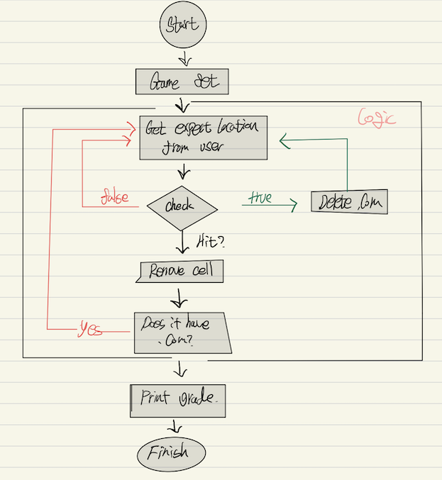

# 메소드를 더 강력하게

## .Com 가라 앉히기 게임

    - 목표 컴퓨터가 가지고 있는 모든 닷컴명을 가능한 적게 찍어서 가라앉히기,성적에 따라 등급 출력
    - 설정 7x7 그리드 위에 배치, 사용자가 입력할수 있는 프롬프트 제공
    - 방법 A3 or C5 등 위치를 입력시 맞으면 hit 틀리면 miss 모두 적중시 "You sunk pets.com" 출력

- 1.  고수준의 설계 부터 시작합니다.
      

          - 최소한 2개의 클래스가 요구 되어짐 (main 실행 클래스, Logic 클래스)
          - 메인 => main 메서드 ? ok!
          - SimpleDotCom => 셀체크할 배열, 점수계산용 인스턴스 선언
              - checkYourslef(String guess) -> 인풋 받아와서 확인하는 로직
              - setLocationCells(int[] loc) -> 세터 메서드 로 배열을 세팅해주는 부분

- 2. 클래스 개발 전 생각 해보고 끄적거려볼것

  - 클래스에서 어떤것을 해야하는지

  - 인스턴스 변수와 메소드 목록 작성

  - 메소드르 위한 준비코드 작성
    - 인간의 언어와 자바 코드의 중간사이 그쯤 어딘가
  - 메소드에 대한 테스트 코드 작성

  - 클래스를 구현

  - 메소드를 테스트 합니다.

  - 필요하면 디버그를 하거나 다시구현 합니다.

- 3. 준비코드(logic)

```java
method: String checkYourself(String userGuess){
    // - Get a String from userGuess
    // - Transfer the type to int from that String

    for(int i=0;i<the int array length;i++){
        // Compare is that right or not;
        if (ok ?){
            Number Count increase
            // Check the numbor count equals array length
            if(NumberCount == array length){
                return "hit";
            }
            return "Fuck that killing it";
        }
        return "miss"
    }
}
```

- 4. 저거에 기반해 테스트 코드를 작성해보자.

  - why ? 오류를 줄일수 있고 작은 부분부터 큰부분으로 확장해 갈수 있는 장점이 있음
  - 레고처럼(유닛테스팅 같네)

  - 어떤걸 테스트 코드를 작성해야하는지 ?

    - checkYourself() 메소드 를 확인 해야함 왜 ? 가장 메인 이 되는 메소드 이기떄문에
    - 저걸 테스트하기 위해서는 ? setter() 은 안하나 ? 별내용이 없어서 아직은 할필요가 없음

    - 1. SimpleDotCom 인스턴스를 만들고
    - 2. 위치를 대입 => {2,3,4} 고정 해서 넣자 테스트니깐
    - 3. 사용자의 추측한 위치를 나타내는 String;
    - 4. 윗단계 에서 만들어낸 String 을 checkYourself(); 에 넘겨준다.
    - 5. 결과를 출력하여 옳은 결과 면 passed or failed

  - 존재하지도 않는 것을 어떻게 테스트 할수 있나 ?
    - 실제 테스트를 하지는 않는다, 다만 이러한 일련의 과정을 통해 더 깔끔하게 메소드를 정리할수 있다.
    - 미리 만들어 두지 않으면 절대 안할껄 아니깐 ㅋㅋㅋ

- 5. ckechYourself() 메소드
  - String 을 인트로 변환 => Integer.parseInt("숫자인 스트링");
    - 반대로 가는것도 있나 ? String valueOf("숫자"), Integer.toString(), String.format()
      - format 이 가장 익숙함 go => fmt.Sprint("숫자");
  - parseInt 함수 인자로 이상한 스트링을 보내면 예외를 던짐 예외처리를 해줘야 하는 부분이 필요할듯

### 핵심

- 고수준 부터 설계를 시작한다.
- 클래스를 만들떄 이와같이 준비한다. 준비코드, 테스트 코드,실제 코드
- 준비코드에 어떻게 해야할지 무엇을 해야할지 를 기술 해야한다. 구현은 나중에
- 테스트 코드를 설계할떄 준비코드를 활용한다.
- 메소드를 구현하기전에 테스트 코드를 만든다 어떻게 ? 뭘 리턴해줄지 알고 있잖아
- 반복횟수가 정해져있을때는 while 보다는 for 를 사용하자.
- 순환문 탈주 "break"

- 5. 준비코드(main)

```java
public static void main(String[] args){
  // Declare numOfGuesses int for saving user guessing
  SimpleDotCom hoit = new SimpleDoCom();
  // Get a number between 0 and 4; caz arr length is 7
  // Create int arr with number which we made previous ont and+1,+2
  hoit.setLocationCells(send what we made before);
  isAlive = true for the game status

  while is Aliving the game{
    get location from user
    //check the location right or not
    hoit.checkYourself()
    numOfGuesses ++
    // check .com died
    if Is that killed ?
      isAlive = false;
      print numOfGuesses;
  }
}
```

- 6. main class

  - int randomNum = (int) (Math.random()\*5);
    - 메스 앞의 인트는 캐스트 왜 써 ? 변수의 크기가 다르기 떄문에 앞에선언한 변수의크기로 강제 변환
  - 캐스트 테스팅
    - long y = 40002;
    - short x = (short) y; => x = -25534 임 y 의 최대값이 x의 최대값 보다 크다면 이상한수나옴

- 7. 실행 테스트
- 1,1,1 을 입력시 ? 죽임으로 나옴
- 우리의 로직에서 오류가 있음 사용한 숫자를 제거해주는 항목을 추가해야할듯함
