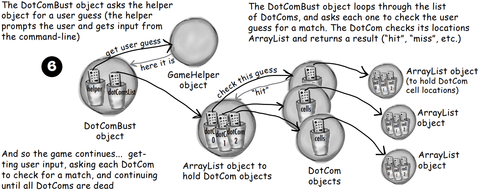

# 자바 API 를 알아보자.

## 5장 의 미니게임의 버그

- 왜? 배열 을 최신화 시켜주지 않기 떄문에 발생되는 오류
- 어떻게 고칠까 ?

  - 1. 새로운 배열을 하나 더만들어 맞추면 트루로 업데이트 해서 배열 2개를 비교 하는 방법(지저분함)

    - 의외로 작업이 복잡해짐 사용자가 맞출떄마다 2번쨰 배열의 상태를 최신화 하고,
    - hitsell 에서 맞췄는지 의 확인작업을 해야함

  - 2. 숫자 인 배열 자체를 힛시킬 경우 -1 로 바꿔 맞춰여부를 파악(1번 보다 좋지만 여전히 더러움)

    - 사용자가 한개이상 맞췄어도 항상 같은배열의 숫자를 루핑해야하기 떄문에 효율적이지 않음

  - 3. 맞출떄마다 배열을 더작게 고치기
    - 배열을 새로 만들고 남아있는값을 새배열에 복사해 레퍼런스 에 대입하는 경우가 아니라면 최적의 방법

## 3번 케이스 ? 라이르버리를 써야할떄 바로 ArrayList 뭘할수 있는가 ?

    - ArrayList<Egg> EggBomb = new ArrayList<Egg>() 만들기 가능
    - Egg may15 = new Egg(); EggBomb.add(may15); 추가하기 가능
    - Egg may14 = new Egg(); EggBomb.add(may14); 두개도 가능
    - EggBomb.size() => 숫자를 리턴하고 , 사이즈도 알려줌
    - EggBomb.contains(may13) => 참,거짓 을 리턴하고 EggBomb 안에 egg 가 있는지 알려줌
    - EggBomb.indexOf(may14) => 숫자를 리턴하고, EggBomb 안에 5월14일 달걀의 인덱스를 리턴한다
    - EggBomb.isempty() => 참,거짓을 리턴하고 말그대로 비어있는 여부파악
    - EggBomb.remove(may14) => 14일 차 달걀을 후라이해먹음 그래서 지움

- ArrayList 는 배열과 비슷한가 ?

  - 그렇다고 볼수도 있지만 다름 go 의 slice 가 생각남 유동적인 사이즈를 가진 배열
  - cf) 작업에 있어 속도의 차이가 있는가 ? 없음 정말 미미한 차이
    - 단 원시유형의 작업은 배열에 넣고 하는게 빠름

- DotCom 에 채용하기 최종 객체 모형
  

## 초강력 부울 표현식

- 1. && And

```java
if((benchPress>100 && backSquat>200 && deadLift>200)){
    System.out.println("3대 500 언더아마 착용이 가능합니다.");
}
```

- 2. || Or

```java
if((benchPress>100 || backSquat>200 || deadLift>200)){
    System.out.println("당신은 운동 중수 이상 !");
}
```

- 3. !=,! 같지않음

```java
if(phone != "iphone"){
    System.out.println("아이폰을 제외한 모든폰")
}
if(!phone.equals("iphone")){
    System.out.println("아이폰을 제외한 모든폰")
}
```

- 4. & |
  - 위에처럼 하나씩 작성한다면 비트를 조작하는 용도로 사용되기도 하지만
  - && || 와 똑같은 역할을 수행 단, 표현식 조건에 상관없이 모든 부분을 검사함
    - ex) if(amISexy && amIHandsome) amISexy 가 false 여도 뒤에 를 확인함

## 라이브러리(자바API)

    - java.lang "필수요소"
    - java.util "자바 유틸리티"
    - java.swing "스윙 클래스"

- import 를 이용해 코드 제일 상단에 작성 단 java.lang 은 그냥 사용해도 무방
- javax 로 시작하는 이름은 ? 패키지가 확장되어 승격된 경우 javax 로 시작함
- 클래스는 패키지 단위로 묶인다.
- 클래스에는 패키지명과 클래스명을 합쳐서 만든 전체 이름이 있다.(java.util.ArrayList)
- java.lang 을 제외한 다른 패키지에 있는친구들은 임포트를 해줘야 사용가능하다.
- 소스코드 맨위에 선어해 사용한다.

- import 를 사용하면 클래스가 커지는가 ?
  - no, include 와 는 다르다, 그냥 타이핑 할 문장이 줄어든다.
- 내가만든 클래스도 패키지에 집어넣야 하는가 ?
  - 실전에서는 필요성이 있다.
